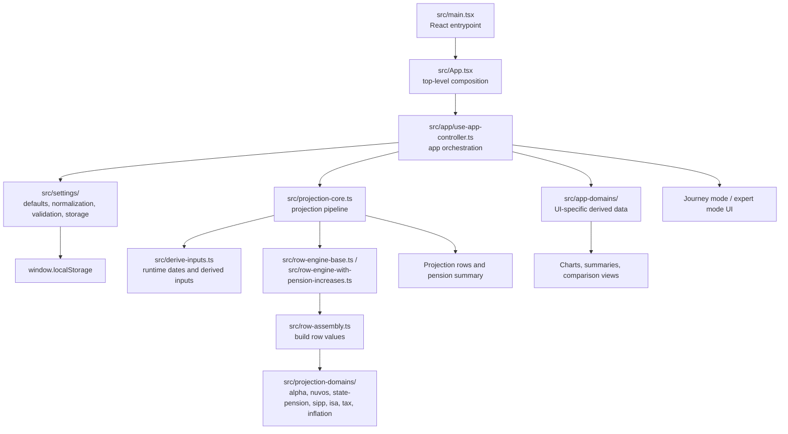
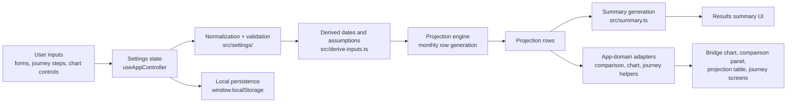

# Civil Service Pension Modeller

A small React and TypeScript app for exploring a projected Civil Service Alpha pension over time.

The modeller models:

- current accrued Alpha pension from the latest Annual Benefit Statement
- ongoing Alpha accrual from pensionable earnings
- Alpha pension draw date and early-retirement reduction
- State Pension draw date derived from date of birth, with optional deferral
  and future uprating
- monthly added pension contributions
- one-off or yearly lump-sum added pension purchases

It presents the result as both a summary and a month-by-month projection table, with milestone rows highlighted for key pension events.

## Architecture

The app is organised around a small set of layers:

- `src/main.tsx` boots the React app and renders `App`.
- `src/App.tsx` composes the main screens and feature sections for journey, expert, comparison, chart, and projection-table views.
- `src/app/use-app-controller.ts` is the main orchestration layer. It owns UI state, persistence hooks, derived view models, and the connection between settings and projection results.
- `src/settings/` contains defaults, normalization, validation, and browser-storage compatibility logic.
- `src/projection-core.ts`, `src/row-assembly.ts`, and `src/projection-domains/` contain the pension modelling engine.
- `src/app-domains/` adapts raw projection results into UI-facing structures such as journey definitions, comparison summaries, and retirement-income series for charts.



The main runtime data flow looks like this:



## What The App Does

The app takes a set of pension assumptions and builds a monthly projection from the chosen calculation start date through the selected life expectancy date.

For each row it calculates:

- age in years and months
- monthly added pension bought from the regular monthly contribution
- any lump-sum added pension bought in that month
- annual accrued Alpha pension
- annual Alpha pension after any early-retirement reduction
- monthly Alpha pension once drawdown starts
- monthly State Pension once it starts
- State Pension deferral uplift and future uprating where enabled
- total monthly pension income

## Main Inputs

The current version is driven by these inputs:

- `Calculation Start Date`
- `Date of Birth`
- `Life Expectancy`
- `Normal Pension Age`
- `State Pension amount`
- `State Pension draw date`
- optional State Pension future growth assumptions
- `Alpha ABS year`
- `Accrued Alpha pension at last ABS`
- `Monthly added pension contribution`
- `Age leaving Alpha pensionable service`
- `Pensionable earnings`
- `Alpha pension draw age`
- optional lump-sum added pension schedules

Lump-sum added pension entries can be:

- `one-off`
- `yearly`

Each lump sum has an amount and purchase date, and yearly entries can repeat until an end date.

## Calculation Notes

Some important current assumptions in the projection logic:

- Alpha accrual is calculated monthly using a `2.32%` annual accrual rate.
- The starting accrued Alpha pension is rolled forward from the ABS date to the chosen calculation start date.
- Accrual stops at the earlier of:
  `Alpha pension draw age` or `Age leaving Alpha pensionable service`.
- Lump-sum added pension is converted into extra annual pension using the age-based factor table in `src/data/alpha_pension_added_pension_factors.json`.
- Lump-sum purchases appear once in the row where they land, then remain embedded in annual accrued pension from that point onward.
- Early-retirement reduction is applied using the factor table in `src/data/alpha_pension_reduction_factors.json`.
- State Pension draw date defaults from date of birth using the current GOV.UK State Pension age timetable, but can be deferred.
- Deferred new State Pension uses the GOV.UK rule of 1% extra for every 9 weeks deferred, once deferred by at least 9 weeks.
- When State Pension future growth is enabled, the base State Pension is uprated using the highest of CPI, wage growth, and 2.5%; deferred extra State Pension is uprated by CPI after draw.

## Project Structure

- [src/main.tsx](/Users/rowan/Documents/github/cs-pension-calculator/src/main.tsx) boots the client app.
- [src/App.tsx](/Users/rowan/Documents/github/cs-pension-calculator/src/App.tsx) composes the main screens and feature sections.
- [src/app/use-app-controller.ts](/Users/rowan/Documents/github/cs-pension-calculator/src/app/use-app-controller.ts) orchestrates application state, persistence, and derived results.
- [src/settings.ts](/Users/rowan/Documents/github/cs-pension-calculator/src/settings.ts) re-exports the settings API.
- [src/settings/](/Users/rowan/Documents/github/cs-pension-calculator/src/settings) holds defaults, types, normalization, validation, and storage helpers.
- [src/projection.ts](/Users/rowan/Documents/github/cs-pension-calculator/src/projection.ts) re-exports the projection API.
- [src/projection-core.ts](/Users/rowan/Documents/github/cs-pension-calculator/src/projection-core.ts) defines the projection pipeline and core result types.
- [src/projection-domains/](/Users/rowan/Documents/github/cs-pension-calculator/src/projection-domains) contains domain-specific calculations for Alpha, Nuvos, State Pension, SIPP, ISA, tax, inflation, and bridge analysis.
- [src/app-domains/](/Users/rowan/Documents/github/cs-pension-calculator/src/app-domains) contains UI-facing adapters for journeys, forms, comparison views, and retirement-income charts.
- [src/data/alpha_pension_added_pension_factors.json](/Users/rowan/Documents/github/cs-pension-calculator/src/data/alpha_pension_added_pension_factors.json) stores age-based added pension purchase factors.
- [src/data/alpha_pension_reduction_factors.json](/Users/rowan/Documents/github/cs-pension-calculator/src/data/alpha_pension_reduction_factors.json) stores early-retirement reduction factors.

Tests are colocated with the code in `src/*.test.ts` and `src/*.test.tsx`.

## Browser Storage

The modeller persists inputs and a few UI preferences using `window.localStorage` on the same device/browser.

Keys currently used:

| Key                                       | Purpose                                                              | Stored value                                                            |
| ----------------------------------------- | -------------------------------------------------------------------- | ----------------------------------------------------------------------- |
| `cs-pension-modeller.settings`            | Pension inputs and assumptions.                                      | JSON object (settings payload).                                         |
| `cs-pension-modeller.appMode`             | Remembers the selected mode.                                         | One of `bridge`, `simple`, `expert`.                                    |
| `cs-pension-modeller.guidanceNotes`       | Remembers whether guidance notes are shown.                          | `"true"` or `"false"`.                                                  |
| `cs-pension-modeller.comparisonScenarios` | Stores up to 5 saved comparison scenarios.                           | JSON array of scenarios `{ id, name, settings, createdAt, updatedAt }`. |
| `cs-pension-modeller.acknowledgement`     | Records that the important information notice has been acknowledged. | Version string (currently `"v1"`).                                      |

To remove all stored data, clear this site’s storage in your browser settings.

## Development

Requirements:

- Node `20.19.0` or newer
- npm `11.12.1`, as recorded in `package.json`

Install dependencies:

```bash
npm install
```

Start the dev server:

```bash
npm run dev
```

Create a production build:

```bash
npm run build
```

Preview the production build locally:

```bash
npm run preview
```

## Testing

Run the test suite:

```bash
npm run test
```

Run the full local quality gate:

```bash
npm run check
```

Run the extended verification suite, including Playwright browser checks,
accessibility checks, and dependency audit:

```bash
npm run check:full
```

Run the broad TypeScript check for app, Vite, Playwright, and E2E files:

```bash
npm run typecheck:all
```

Static analysis is performed with type-aware `eslint` backed by
`typescript-eslint` and `eslint-plugin-sonarjs`, so `npm run lint` checks for
TypeScript misuse and common bug patterns in addition to normal lint rules.
GitHub Actions workflow files are linted in CI with `actionlint`; if you have
the `actionlint` binary installed locally, run `npm run lint:actions`.

This repository also includes a Git `pre-commit` hook in `.githooks/pre-commit`
that runs formatting, linting, and type checks. The `pre-push` hook runs unit
tests, Playwright journey tests, Playwright accessibility tests, and a build.
Publish-time checks run through `.githooks/pre-publish`, which npm calls from
its `prepublishOnly` hook before publish. GitHub Desktop uses normal Git hooks,
so once `core.hooksPath` is set to `.githooks` for the clone, commits made in
GitHub Desktop will run the same local hooks.

Run tests with coverage:

```bash
npm run test:coverage
```

Run tests in watch mode:

```bash
npm run test:watch
```

Run the Playwright journey checks:

```bash
npm run test:e2e
```

Run the Playwright production build smoke checks:

```bash
npm run test:smoke:prod
```

Run the Playwright accessibility checks:

```bash
npm run test:a11y
```

The accessibility checks use `@axe-core/playwright` against key app states:

- the first-run acknowledgement dialog
- the main mode-selection screen
- the simple and expert journey entry screens
- the bridge journey results screen
- the static About, Methodology, and Privacy pages

These automated axe checks help catch regressions in CI, but they do not prove
full WCAG compliance. Manual keyboard, focus-management, zoom, and screen-reader
checks are still needed before release.

Dependency updates are managed by Dependabot for npm packages and GitHub
Actions. Pull requests also run GitHub's Dependency Review action so dependency
changes are checked before merge. `npm audit` runs in `npm run check:full` for
local verification and in a scheduled/manual GitHub Actions workflow, rather
than blocking every pull request on transient advisory noise.

## Purpose

The goal of the project is to make pension timing decisions easier to reason about by turning a set of assumptions into something visual, editable, and testable.
