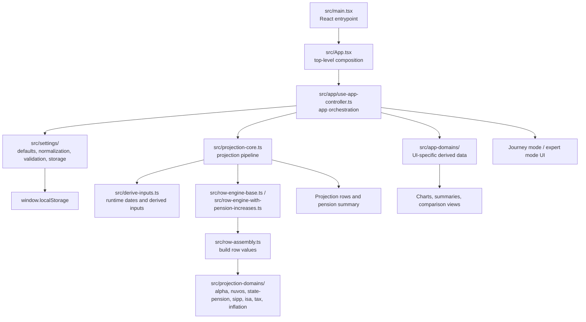
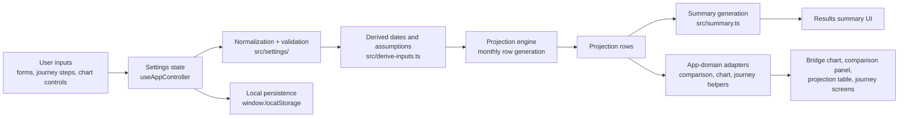

# Civil Service Pension Modeller

A static React, TypeScript, and Vite app for exploring UK Civil Service pension
and retirement-income scenarios.

The modeller helps compare how different assumptions affect projected income
over time. It can include Civil Service Alpha, classic, classic plus, nuvos and
Premium pensions, State Pension, ISA, Lifetime ISA (LISA) and SIPP bridge
funding,
partial retirement, inflation, simplified Income Tax, and saved scenario
comparisons.

This project is for planning and illustration only. It is not financial advice,
and it is not affiliated with the Civil Service Pension Scheme, Capita, the
Cabinet Office, or the Alpha Pension Scheme. Users should check important
decisions against official pension statements and seek regulated financial
advice where appropriate.

## What The App Does

The app takes user-entered pension, savings, tax, inflation, and retirement
timing assumptions and builds a month-by-month projection from the selected
calculation start date to the selected planning horizon.

It supports:

- simple, early-retirement bridge, and expert journeys
- optional Alpha, classic, classic plus, nuvos, Premium, State Pension, SIPP,
  ISA, LISA, taxation, and partial retirement sections
- Alpha pension accrual from Annual Benefit Statement values and future
  pensionable earnings
- Alpha early-retirement reduction and CPI-linked pension-increase modelling
- Alpha added pension through monthly contributions and lump-sum purchase
  schedules
- classic and classic plus modelling from known preserved benefits or final
  salary and service details, including automatic lump sums and age-60
  early-payment reductions
- nuvos pension modelling with separate statement, leave, draw, and increase
  assumptions
- Premium pension modelling as a preserved closed legacy pension with CPI-only
  revaluation to the selected draw age
- State Pension age, optional deferral, and optional future uprating assumptions
- SIPP, ISA and LISA balances, regular contributions, lump sums, investment
  growth, and flexible withdrawal strategies
- bridge analysis for the period before secure pension income starts
- simplified UK Income Tax estimates for gross and take-home income comparison
- real-terms and nominal-terms projection bases
- saved scenarios for side-by-side comparison
- projection charts, summaries, and detailed projection tables

The app presents results as planning estimates. It should not present modelled
figures as guaranteed outcomes.

## Core Modelling Outputs

For each projection month, the model can calculate values such as:

- age in years and months
- Alpha, classic, classic plus, nuvos, and Premium accrued or preserved pension
- Alpha, classic, classic plus, nuvos, and Premium pension after any
  early-payment reduction where the model has the relevant scheme rules
- monthly Civil Service pension income once drawn
- monthly State Pension once it starts
- State Pension deferral uplift and future uprating where enabled
- ISA, LISA and SIPP balances, withdrawals, and bridge funding
- gross retirement income by source
- estimated Income Tax and take-home income where taxation is enabled
- milestone rows for important dates such as statement dates, pension starts,
  drawdown starts, and planning end age

## Main Inputs

The current app is driven by inputs grouped around:

- personal details: calculation start date, birth month/year, retirement target,
  and planning horizon
- projection basis: real or nominal values, inflation assumptions, investment
  growth assumptions, and pension increase settings
- Alpha pension: ABS year, accrued pension, pensionable earnings, leave age,
  draw age, and added pension
- EPA: selected EPA years before Normal Pension Age and the EPA purchase date
  range
- classic and classic plus pensions: known annual pension and automatic lump
  sum values, or final pensionable earnings and reckonable service inputs
- nuvos pension: statement year, accrued pension, draw age, and pension
  increases
- Premium pension: preserved annual pension, valuation date, draw age, Normal
  Pension Age, and earliest access age
- State Pension: annual amount, start date, deferral, and future growth
  assumptions
- SIPP, ISA and LISA: current balances, contributions, lump sums, growth, draw
  ages, withdrawal strategies, and use-by ages
- partial retirement: start age and working percentage
- taxation: configurable simplified UK Income Tax assumptions
- comparison: saved scenario names and settings snapshots

Optional sections can be hidden without deleting their saved values, so users
can compare scenarios without repeatedly re-entering data.

## Important Assumptions

Some important assumptions and simplifications are:

- Alpha accrual is calculated from pensionable earnings using the Alpha accrual
  rate encoded in the model.
- The starting Alpha pension is rolled forward from the latest ABS year to the
  calculation start date.
- Future Alpha accrual depends on pensionable earnings, and Alpha CPI-linked
  pension increases use the central projection basis and inflation assumption.
- nuvos pensionable-service accrual is capped at 31 March 2015; after then,
  modelled nuvos changes come from CPI-linked pension increases only.
- classic pension estimates use final pensionable earnings multiplied by
  reckonable service divided by 80, with an automatic lump sum of three times
  the annual pension.
- classic plus estimates split pre-2002 service at 1/80 with an automatic lump
  sum from that part, and post-2002 service at 1/60 with no automatic lump sum
  in the model.
- classic and classic plus use age 60 as Normal Pension Age, with early-payment
  reductions modelled as 5% per year early, pro-rated by month.
- Premium is treated as a preserved closed legacy pension. The model does not
  add Premium accrual or contributions, does not link it to salary growth, and
  only revalues the entered amount by CPI to the selected draw age.
- Premium early-retirement reductions at supported whole-year draw ages from 55
  use the GAD consolidated Civil Service factors workbook version 2026-01:
  table 1-406/P1ER60PEN1 for NPA 60 and table 1-410/P1ER65PEN1 for NPA 65. The
  values and source metadata are stored in
  [`src/data/premium_pension_reduction_factors.json`](src/data/premium_pension_reduction_factors.json).
  The app does not approximate unsupported under-55, fractional-age, or other
  personal-NPA cases using Alpha or nuvos rules.
- Alpha added pension lump sums are converted using factor data stored in
  [`src/data/alpha_pension_added_pension_factors.json`](src/data/alpha_pension_added_pension_factors.json).
- Alpha early-payment reduction uses factor data stored in
  [`src/data/alpha_pension_reduction_factors.json`](src/data/alpha_pension_reduction_factors.json).
- State Pension age is derived from date of birth using the timetable encoded in
  the app and can be deferred.
- New State Pension deferral uses the post-2016 rule modelled by the app.
- ISA, LISA and SIPP projections depend directly on entered balances,
  contributions, lump sums, growth assumptions, draw ages, and withdrawal
  strategy. LISA additions are capped at the modelled Lifetime ISA annual
  allowance, receive the modelled government bonus on eligible additions, stop
  at age 50, and are modelled for retirement withdrawals from age 60.
- Income Tax is simplified and configurable. It does not cover every personal
  tax circumstance, devolved tax regime, tax code adjustment, or benefit
  interaction.
- Results are deterministic scenario outputs, not probabilistic forecasts.

For more detail, see the in-app Methodology page.

## Architecture

The app is organised around a small set of layers:

- [`src/main.tsx`](src/main.tsx) boots the React app.
- [`src/App.tsx`](src/App.tsx) composes the main app screens and feature
  sections.
- [`src/app/use-app-controller.ts`](src/app/use-app-controller.ts) orchestrates
  UI state, persistence, validation, derived results, and projection updates.
- [`src/settings/`](src/settings) contains defaults, normalization, validation,
  storage, and schema migration logic.
- [`src/projection-core.ts`](src/projection-core.ts),
  [`src/row-assembly.ts`](src/row-assembly.ts), and the row engines contain the
  projection pipeline.
- [`src/projection-domains/`](src/projection-domains) contains domain-specific
  calculations for Alpha, nuvos, State Pension, SIPP, ISA, LISA, tax,
  inflation, and bridge analysis.
- [`src/app-domains/`](src/app-domains) adapts raw projection results into
  UI-facing journey, form, chart, comparison, and summary structures.
- [`src/pages/`](src/pages) contains the static footer pages for Settings,
  Privacy, Methodology, About, and Feedback-related navigation.
- [`e2e/`](e2e) contains Playwright journey, accessibility, and production
  smoke checks.



The main runtime data flow is:



Calculation and domain logic should stay separate from presentation code where
practical.

## Browser Storage And Privacy

By default, the modeller persists inputs and a few UI preferences using
`window.localStorage` on the same device/browser. The Settings page lets users
turn local saving off, export parameters to JSON, load a parameter JSON file, or
reset parameters to defaults.

When local saving is turned off, saved modeller data is removed from browser
storage and future automatic saves are skipped. The app keeps only the local
saving preference so the browser can remember that saving is off.

Keys currently used:

| Key                                       | Purpose                                                                                            | Stored value                                                                    |
| ----------------------------------------- | -------------------------------------------------------------------------------------------------- | ------------------------------------------------------------------------------- |
| `cs-pension-modeller.localStorageEnabled` | Remembers whether local saving is enabled.                                                         | `"true"` or `"false"`.                                                          |
| `cs-pension-modeller.settings`            | Pension inputs and assumptions, when local saving is enabled.                                      | JSON object envelope `{ version, data }`, where `data` is the settings payload. |
| `cs-pension-modeller.appMode`             | Remembers the selected mode, when local saving is enabled.                                         | One of `bridge`, `simple`, `expert`.                                            |
| `cs-pension-modeller.guidanceNotes`       | Remembers whether guidance notes are shown, when local saving is enabled.                          | `"true"` or `"false"`.                                                          |
| `cs-pension-modeller.comparisonScenarios` | Stores up to 5 saved comparison scenarios, when local saving is enabled.                           | JSON array of scenarios `{ id, name, settings, createdAt, updatedAt }`.         |
| `cs-pension-modeller.acknowledgement`     | Records that the important information notice has been acknowledged, when local saving is enabled. | Version string, currently `"v1"`.                                               |

Settings storage is schema-versioned. Current saves use a versioned envelope so
older browser data can be migrated safely when fields are renamed or
restructured. The current migration history is documented in
[`docs/settings-schema-version-history.md`](docs/settings-schema-version-history.md).

## Analytics

Google Analytics is disabled unless `VITE_GA_MEASUREMENT_ID` is set for the
Vite build. When configured, the app sends coarse interaction events only:
page views, notice acknowledgement, selected journey, journey step, changed
field identifier, comparison actions, and chart control names.
The GitHub Pages deployment workflow reads this value from the
`VITE_GA_MEASUREMENT_ID` repository secret.

Analytics events must not include entered amounts, dates, ages, scenario names,
pension identifiers, saved settings payloads, or calculated retirement income
figures.

## Development

Requirements:

- Node `20.19.0` or newer
- npm, using the committed `package-lock.json`

Install dependencies:

```bash
npm install
```

Start the dev server:

```bash
npm run dev
```

Create a production build:

```bash
npm run build
```

Preview the production build locally:

```bash
npm run preview
```

## Testing

Run the unit and component test suite:

```bash
npm run test
```

Run the standard local quality gate:

```bash
npm run check
```

Run the extended verification suite, including Playwright browser checks,
accessibility checks, production smoke checks, and dependency audit:

```bash
npm run check:full
```

Useful individual checks:

```bash
npm run format:check
npm run lint
npm run typecheck:all
npm run test:coverage
npm run test:bdd
npm run test:e2e
npm run test:a11y
npm run test:smoke:prod
```

Static analysis is performed with type-aware ESLint backed by
`typescript-eslint` and `eslint-plugin-sonarjs`, so `npm run lint` checks for
TypeScript misuse and common bug patterns in addition to normal lint rules.

The Cucumber/Gherkin suite under [`features/`](features) is for fast executable
business rules and pension acceptance examples. Step definitions should exercise
production domain, projection, settings, or app-domain APIs rather than browser
automation. Browser journeys, routing, storage flows, layout, accessibility, and
production smoke coverage live in [`e2e/`](e2e) Playwright specs.

GitHub Actions workflow files are linted in CI with `actionlint`. If the
`actionlint` binary is installed locally, run:

```bash
npm run lint:actions
```

The accessibility checks use `@axe-core/playwright` against key app states:

- the first-run acknowledgement dialog
- the main mode-selection screen
- the simple and expert journey entry screens
- the bridge journey results screen
- the footer pages: Settings, About, Methodology, and Privacy

Automated axe checks help catch regressions in CI, but they do not prove full
WCAG compliance. Manual keyboard, focus-management, zoom, and screen-reader
checks are still needed before release.

This repository includes Git hooks in [`.githooks/`](.githooks). Once
`core.hooksPath` is set to `.githooks` for the clone, commits and pushes run
the same local checks that are expected before review.

## CI/CD

GitHub Actions cover formatting, linting, TypeScript checks, test coverage,
BDD acceptance tests, production build, Playwright journeys, axe accessibility
checks, production smoke checks, dependency review, CodeQL, scheduled/manual npm
audit, and GitHub Pages deployment from `main`.

Dependency updates are managed by Dependabot for npm packages and GitHub
Actions. Pull requests also run GitHub's Dependency Review action so dependency
changes are checked before merge. `npm audit` runs in `npm run check:full` for
local verification and in a scheduled/manual GitHub Actions workflow, rather
than blocking every pull request on transient advisory noise.

## Purpose

The goal of the project is to make pension timing and retirement-income
trade-offs easier to reason about by turning a set of assumptions into
something visual, editable, and testable.
