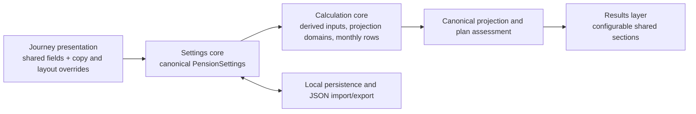

# Civil Service Pension Modeller

A static React, TypeScript, and Vite app for exploring UK Civil Service pension
and retirement-income scenarios.

The modeller helps compare how different assumptions affect projected income
over time. It can include Civil Service Alpha, classic, classic plus, nuvos and
Premium pensions, State Pension, ISA, Lifetime ISA (LISA) and SIPP bridge
funding,
partial retirement, inflation, simplified Income Tax, and saved scenario
comparisons.

This project is for planning and illustration only. It is not financial advice,
and it is not affiliated with the Civil Service Pension Scheme, Capita, the
Cabinet Office, or the Alpha Pension Scheme. Users should check important
decisions against official pension statements and seek regulated financial
advice where appropriate.

## What The App Does

The app takes user-entered pension, savings, tax, inflation, and retirement
timing assumptions and builds a month-by-month projection from the current date
to the selected planning horizon. The calculation start is set automatically.

It supports:

- simple, early-retirement bridge, and expert journeys
- optional Alpha, classic, classic plus, nuvos, Premium, State Pension, SIPP,
  ISA, LISA, taxation, and partial retirement sections
- Alpha pension accrual from Annual Benefit Statement values and future
  pensionable earnings
- Alpha early-retirement reduction and CPI-linked pension-increase modelling
- Alpha added pension through monthly contributions and lump-sum purchase
  schedules
- classic and classic plus modelling from known preserved benefits or final
  salary and service details, including automatic lump sums and age-60
  early-payment reductions
- nuvos pension modelling with separate statement, leave, draw, and increase
  assumptions
- Premium pension modelling as a preserved closed legacy pension with CPI-only
  revaluation to the selected draw age
- State Pension age, optional deferral, and optional future uprating assumptions
- SIPP, Civil Service AVC, ISA and LISA balances, regular contributions, lump
  sums, investment growth, explicit withdrawal strategies, and coordinated
  target-based drawdown
- avoidable flexible-fund surplus insights with gross reducible withdrawals,
  estimated unallocated net surplus, residual-balance warnings, account
  attribution, and non-destructive target-based previews
- bridge analysis for the period before secure pension income starts
- simplified 2026/27 Income Tax liability estimates for England, Wales,
  Northern Ireland and Scotland, comparing gross income with income after the
  modelled liability
- real-terms and nominal-terms projection bases
- saved scenarios for side-by-side comparison
- projection charts, summaries, and detailed projection tables

The app presents results as planning estimates. It should not present modelled
figures as guaranteed outcomes.

## Core Modelling Outputs

For each projection month, the model can calculate values such as:

- age in years and months
- Alpha, classic, classic plus, nuvos, and Premium accrued or preserved pension
- Alpha, classic, classic plus, nuvos, and Premium pension after any
  early-payment reduction where the model has the relevant scheme rules
- monthly Civil Service pension income once drawn
- monthly State Pension once it starts
- State Pension deferral uplift and future uprating where enabled
- ISA, LISA and SIPP balances, withdrawals, and bridge funding
- gross retirement income by source
- estimated Income Tax liability and take-home income where taxation is enabled
  or an after-tax spending target is selected
- milestone rows for important dates such as statement dates, pension starts,
  drawdown starts, and planning end age

## Main Inputs

The current app is driven by inputs grouped around:

- personal details: birth month/year and planning horizon
- retirement income target: an explicit before-tax income or after-tax spending
  basis, with a selected Retirement Living Standards baseline and either flat
  spending or expert Go-Go, Slow-Go, No-Go phase percentages
- projection basis: real or nominal values, inflation assumptions, investment
  growth assumptions, and pension increase settings
- Alpha pension: ABS year, accrued pension, pensionable earnings, leave age,
  draw age, and added pension
- EPA: one or more dated EPA −1, −2 or −3 purchase periods, including gaps,
  partial years, restarts, and option changes
- classic and classic plus pensions: known annual pension and automatic lump
  sum values, or final pensionable earnings and reckonable service inputs
- nuvos pension: statement year, accrued pension, draw age, and pension
  increases
- Premium pension: preserved annual pension, valuation date, draw age, Normal
  Pension Age, and earliest access age
- State Pension: annual amount, start date, deferral, and future growth
  assumptions
- SIPP, ISA and LISA: current balances, contributions, lump sums, growth, draw
  ages, withdrawal strategies, and use-by ages
- partial retirement: start age and working percentage
- taxation: a 2026/27 rest-of-UK or Scottish regime, configurable rate and
  allowance assumptions, explicit SIPP and CS AVC withdrawal treatment, and a
  shared pension lump-sum allowance
- comparison: saved scenario names and settings snapshots

Optional sections can be hidden without deleting their saved values, so users
can compare scenarios without repeatedly re-entering data.

## Important Assumptions

Some important assumptions and simplifications are:

- Numeric modelling ages are represented in quarter-year steps (whole years,
  then 3, 6 or 9 months). Values entered, derived or loaded from an older saved
  file are rounded to the nearest quarter year and that rounded value is used
  throughout the model. Calendar-date inputs and the monthly projection retain
  their date or month resolution.
- Alpha accrual is calculated from pensionable earnings using the Alpha accrual
  rate encoded in the model.
- The starting Alpha pension is rolled forward from the latest ABS year to the
  current date, which is used as the internal calculation start date.
- Future Alpha accrual depends on pensionable earnings, and Alpha CPI-linked
  pension increases use the central projection basis and inflation assumption.
- nuvos pensionable-service accrual is capped at 31 March 2015; after then,
  modelled nuvos changes come from CPI-linked pension increases only.
- classic pension estimates use final pensionable earnings multiplied by
  reckonable service divided by 80, with an automatic lump sum of three times
  the annual pension.
- classic plus estimates split pre-2002 service at 1/80 with an automatic lump
  sum from that part, and post-2002 service at 1/60 with no automatic lump sum
  in the model.
- classic and classic plus use age 60 as Normal Pension Age, with early-payment
  reductions modelled as 5% per year early, pro-rated by month.
- Premium is treated as a preserved closed legacy pension. The model does not
  add Premium accrual or contributions, does not link it to salary growth, and
  revalues the entered amount by CPI before and after the selected draw age
  using a simplified whole-year convention.
- Premium early-retirement reductions at supported draw ages from 55 use the
  completed-years-and-months entries in GAD consolidated Civil Service factors
  workbook version 2026-01: table 1-406/P1ER60PEN1 for NPA 60 and table
  1-410/P1ER65PEN1 for NPA 65. The on-screen control selects quarter years. The
  values and source metadata are stored in
  [`src/data/premium_pension_reduction_factors.json`](src/data/premium_pension_reduction_factors.json).
  The app does not approximate unsupported under-55 or personal-NPA cases using
  Alpha or nuvos rules.
- Alpha added pension uses GAD consolidated Civil Service factors workbook
  version 2026-01. Lump sums use tables 0-714 to 0-717, regular contributions
  use tables 0-718 to 0-721, and purchases use the revaluation factors in table
  0-728. The model selects or interpolates the member's Alpha Normal Pension
  Age table and stores the values with source metadata in
  [`src/data/alpha_pension_added_pension_factors.json`](src/data/alpha_pension_added_pension_factors.json).
- Alpha early-payment reduction uses the completed-years-and-months entries
  from GAD workbook version 2026-01, tables 0-402 to 0-405, stored with source
  metadata in
  [`src/data/alpha_pension_reduction_factors.json`](src/data/alpha_pension_reduction_factors.json).
  It uses the published monthly retirement-age entry directly and interpolates
  between NPA/EPA tables only where the NPA/EPA itself is non-integer.
- State Pension age is derived from date of birth using the timetable encoded in
  the app and can be deferred.
- The full new State Pension rate is used only as an explicitly unconfirmed
  fallback. An on-track result is marked as needing a check when the target
  depends on that assumption. If the target remains met without it, the result
  stays on track with a caution until the user confirms an amount from their
  personalised GOV.UK forecast.
- New State Pension deferral uses the post-2016 rule modelled by the app.
- ISA, LISA and SIPP projections depend directly on entered balances,
  contributions, lump sums, growth assumptions, draw ages, and withdrawal
  strategy. LISA additions are capped at the modelled Lifetime ISA annual
  allowance, receive the modelled government bonus on eligible additions, stop
  at age 50, and are modelled for retirement withdrawals from age 60.
- Income Tax is enabled for new plans by default and uses the selected 2026/27
  regime throughout the projection. The retirement income target has an
  explicit basis: gross targets are compared with income before tax, while
  after-tax targets are compared with income available to spend after estimated
  Income Tax. Selecting an after-tax target enables the tax estimate.
  Scottish pension income uses the published starter, basic, intermediate,
  higher, advanced and top bands. Modelled taxable income is grouped into
  April-to-March years and one annual liability is allocated across taxable
  rows; this is not PAYE deduction forecasting. New plans track the selected
  shared pension lump-sum allowance across modelled classic, classic plus, SIPP
  and CS AVC benefits, while migrated plans retain their previous untracked
  behavior. Before retirement, the entered full salary is used only as tax-rate
  context and is not added to the retirement-income chart. Reduced-hours
  employment during partial retirement is included in both income and tax. In
  the final partial tax year, the last modelled taxable monthly income is
  assumed to continue to the following 5 April for tax-rate context only; this
  does not extend the cash-flow projection. The estimate does not cover every
  personal tax circumstance, employment income that differs from the entered
  salary assumption, future tax-year changes, tax-code adjustments, savings or
  dividend income, annual-allowance charges, or benefit interactions.
- Results are deterministic scenario outputs, not probabilistic forecasts.

For more detail, see the in-app Methodology page.

## Architecture

The app is organised around four main layers. Journeys are presentation
compositions: they choose shared fields, labels, help text, update behaviour,
and results sections, but they do not select a different calculation engine.

- [`src/main.tsx`](src/main.tsx) boots the React app.
- [`src/App.tsx`](src/App.tsx) composes the main app screens and feature
  sections.
- [`src/app/use-app-controller.ts`](src/app/use-app-controller.ts) orchestrates
  UI state, persistence, validation, derived results, and projection updates.
- [`src/app-domains/journeys.ts`](src/app-domains/journeys.ts) defines the
  presentation composition for the simplified, early-retirement, and expert
  journeys. It references shared field definitions and configures shared
  results sections; journey identity is not passed into the calculation core.
- [`src/settings/`](src/settings) contains defaults, normalization, validation,
  storage, and schema migration logic. Each journey owns one canonical
  `PensionSettings` value: the saved and exported settings are the settings
  validated and projected, with no separate hidden runtime settings overlay.
- [`src/projection-core.ts`](src/projection-core.ts),
  [`src/row-assembly.ts`](src/row-assembly.ts), and the row engines contain the
  projection pipeline.
- [`src/projection-domains/`](src/projection-domains) contains domain-specific
  calculations for Alpha, nuvos, State Pension, SIPP, ISA, LISA, tax,
  inflation, and bridge analysis.
- [`src/app-domains/`](src/app-domains) adapts raw projection results into
  UI-facing form, chart, comparison, summary, and canonical retirement plan
  assessment structures.
- [`src/pages/`](src/pages) contains the static footer pages for Settings,
  Privacy, Methodology, About, and Feedback-related navigation.
- [`e2e/`](e2e) contains Playwright journey, accessibility, and production
  smoke checks.


```mermaid
flowchart LR
    A["Journey presentation<br/>shared fields + copy and layout overrides"] --> B["Settings core<br/>canonical PensionSettings"]
    B --> C["Calculation core<br/>derived inputs, projection domains, monthly rows"]
    C --> D["Canonical projection and plan assessment"]
    D --> E["Results layer<br/>configurable shared sections"]
    B <--> F["Local persistence and JSON import/export"]
```

The journey configuration can present the same field differently without
duplicating its setting or calculation. It can also turn shared results
components on or off, or select their simple, standard, or detailed
presentation. The current compositions are:

| Journey                              | Input presentation                                                              | Results composition                                                                                      |
| ------------------------------------ | ------------------------------------------------------------------------------- | -------------------------------------------------------------------------------------------------------- |
| Simplified retirement journey        | Short guided sequence with plain-language field labels and constrained defaults | Simple summary, simple retirement-income chart, income details, and concise inflation disclosure         |
| Work out what I need to retire early | Guided sequence focused on retirement timing and flexible funds                 | Standard summary and retirement-income chart, expanded inflation basis, comparison, and projection table |
| Expert journey                       | Full field groups and advanced controls                                         | Detailed summary and retirement-income chart, expanded inflation basis, comparison, and projection table |

The bridge analysis remains a shared illustrative funding diagnostic used by
plan assessment and comparison. It is not a journey-specific calculation path,
and the main results visual is the retirement-income chart built from the
canonical projection.

## Browser Storage And Privacy

By default, the modeller persists inputs and a few UI preferences using
`window.localStorage` on the same device/browser. The Settings page lets users
turn local saving off, export parameters to JSON, load a parameter JSON file, or
reset parameters to defaults.

When local saving is turned off, saved modeller data is removed from browser
storage and future automatic saves are skipped. The app keeps only the local
saving preference so the browser can remember that saving is off.

Keys currently used:

| Key                                       | Purpose                                                                                            | Stored value                                                                        |
| ----------------------------------------- | -------------------------------------------------------------------------------------------------- | ----------------------------------------------------------------------------------- |
| `cs-pension-modeller.localStorageEnabled` | Remembers whether local saving is enabled.                                                         | `"true"` or `"false"`.                                                              |
| `cs-pension-modeller.settings`            | Pension inputs and assumptions for each journey, when local saving is enabled.                     | JSON object envelope `{ version, data: { journeys: { simple, bridge, expert } } }`. |
| `cs-pension-modeller.appMode`             | Remembers the selected mode, when local saving is enabled.                                         | One of `bridge`, `simple`, `expert`.                                                |
| `cs-pension-modeller.guidanceNotes`       | Remembers whether guidance notes are shown, when local saving is enabled.                          | `"true"` or `"false"`.                                                              |
| `cs-pension-modeller.comparisonScenarios` | Stores up to 5 saved comparison scenarios, when local saving is enabled.                           | JSON array of scenarios `{ id, name, settings, createdAt, updatedAt }`.             |
| `cs-pension-modeller.acknowledgement`     | Records that the important information notice has been acknowledged, when local saving is enabled. | Version string, currently `"v1"`.                                                   |

Settings storage is schema-versioned. Current saves use a versioned envelope so
older browser data can be migrated safely when fields are renamed or
restructured. The migration implementations and their compatibility tests live
in `src/settings/settings-migrations.ts` and
`src/settings/settings-migrations.test.ts`. Each journey has an independent
settings section in the same saved file, so changing one journey does not alter
another. Schema version 16 materialises the Simplified journey assumptions that
older releases applied only while calculating, so its saved, exported, and
calculated settings now agree. The migration preserves entered retirement ages
and does not alter the early-retirement or expert journey settings. Legacy flat
settings and parameter exports remain supported. In the Simplified workspace,
inactive EPA and additional-income schedules are retained behind their disabled
settings; Alpha Added Pension contributions and purchase schedules are cleared
because that journey does not expose an enable/disable control for them and
they would otherwise affect its projection. A legacy flat file still seeds all
three sections, so its full values remain available in the expert workspace,
with the guided-journey defaults applied separately to the simple and
early-retirement sections. This compatibility path has no time-based expiry.

## Analytics

Google Analytics is disabled unless `VITE_GA_MEASUREMENT_ID` is set for the
Vite build. When configured, the app sends coarse interaction events only:
page views, notice acknowledgement, selected journey, journey step, changed
field identifier, comparison actions, and chart control names.
The GitHub Pages deployment workflow reads this value from the
`VITE_GA_MEASUREMENT_ID` repository secret.

Analytics events must not include entered amounts, dates, ages, scenario names,
pension identifiers, saved settings payloads, or calculated retirement income
figures.

## Development

Requirements:

- Node `20.19.0` or newer
- npm, using the committed `package-lock.json`

Install dependencies:

```bash
npm install
```

Start the dev server:

```bash
npm run dev
```

Create a production build:

```bash
npm run build
```

Preview the production build locally:

```bash
npm run preview
```

## Testing

Run the unit and component test suite:

```bash
npm run test
```

Run the standard local quality gate:

```bash
npm run check
```

Run the extended verification suite, including Playwright browser checks,
accessibility checks, production smoke checks, and dependency audit:

```bash
npm run check:full
```

Useful individual checks:

```bash
npm run format:check
npm run lint
npm run typecheck:all
npm run test:coverage
npm run test:bdd
npm run test:e2e
npm run test:a11y
npm run test:smoke:prod
```

Static analysis is performed with type-aware ESLint backed by
`typescript-eslint` and `eslint-plugin-sonarjs`, so `npm run lint` checks for
TypeScript misuse and common bug patterns in addition to normal lint rules.

The Cucumber/Gherkin suite under [`features/`](features) is for fast executable
business rules and pension acceptance examples. Step definitions should exercise
production domain, projection, settings, or app-domain APIs rather than browser
automation. Browser journeys, routing, storage flows, layout, accessibility, and
production smoke coverage live in [`e2e/`](e2e) Playwright specs.

GitHub Actions workflow files are linted in CI with `actionlint`. If the
`actionlint` binary is installed locally, run:

```bash
npm run lint:actions
```

The accessibility checks use `@axe-core/playwright` against key app states:

- the first-run acknowledgement dialog
- the main mode-selection screen
- the simple and expert journey entry screens
- the bridge journey results screen
- the footer pages: Settings, About, Methodology, and Privacy

Automated axe checks help catch regressions in CI, but they do not prove full
WCAG compliance. Manual keyboard, focus-management, zoom, and screen-reader
checks are still needed before release.

This repository includes Git hooks in [`.githooks/`](.githooks). `npm install`
and `npm ci` configure `core.hooksPath` for the clone automatically, so commits
and pushes—including those made with GitHub Desktop—run the same local checks
that are expected before review. To repair the setting without reinstalling
dependencies, run `npm run setup:hooks`.

## CI/CD

GitHub Actions cover formatting, linting, TypeScript checks, test coverage,
BDD acceptance tests, production build, Playwright journeys, axe accessibility
checks, production smoke checks, dependency review, CodeQL, scheduled/manual npm
audit, and GitHub Pages deployment from `main`.

Dependency updates are managed by Dependabot for npm packages and GitHub
Actions. Pull requests also run GitHub's Dependency Review action so dependency
changes are checked before merge. `npm audit` runs in `npm run check:full` for
local verification and in a scheduled/manual GitHub Actions workflow, rather
than blocking every pull request on transient advisory noise. To apply npm's
non-breaking automatic remediations, run `npm run audit:fix`, review the
dependency and lockfile changes, and then run `npm run check:full`. Do not use
`npm audit fix --force` without reviewing and explicitly accepting its proposed
major-version changes.

Dependabot groups `react` and `react-dom` updates because React requires those
runtime packages to use exactly the same version. Dependabot pull requests,
including major updates, are merged only after the exact pull request head has
passed the complete CI workflow. The merger then explicitly dispatches CI on
the updated `main` branch so deployment checks still run when GitHub suppresses
normal `push` events created by `GITHUB_TOKEN`. Updates with failing checks or
merge conflicts remain open. The workflow also sweeps already-open, successful
Dependabot pull requests after pushes to `main` and when manually dispatched.
It does not require repository auto-merge, a branch-refresh workflow, or a
personal access token.

TypeScript 7 updates are temporarily ignored because the current
`typescript-eslint` peer range requires TypeScript below 6.1. Remove that
constraint once the lint toolchain officially supports TypeScript 7.

## Purpose

The goal of the project is to make pension timing and retirement-income
trade-offs easier to reason about by turning a set of assumptions into
something visual, editable, and testable.
